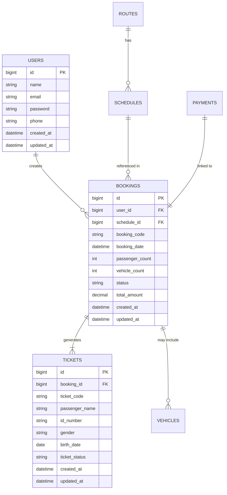

# 🚢 Ferry Booking System

[](https://laravel.com)
[](https://flutter.dev)
[](https://tailwindcss.com/)
[](https://www.mysql.com/)
[](LICENSE)

The Ferry Booking System consists of three main components: a backend API, a mobile application for users, and a web-based admin panel. This system is designed to facilitate ferry ticket booking with the best security features and convenience.

<p align="center">
  
</p>

## 📋 Table of Contents

- [Overview](#-overview)
- [System Architecture](#-system-architecture)
- [Repositories](#-repositories)
  - [Backend API](#-backend-api)
  - [Mobile Application](#-mobile-application)
  - [Admin Panel](#-admin-panel)
- [Main Features](#-main-features)
- [Security](#-security)
- [Installation](#-installation)
- [Contribution](#-contribution)
- [License](#-license)

## 🌟 Overview

The Ferry Booking System is a comprehensive solution for ferry ticket management consisting of:

1. **Backend API** - Provides backend services for the mobile application and admin panel
2. **Mobile Application** - The main user interface for ticket purchases
3. **Admin Panel** - Web interface for system management

This system is designed to support ticket booking, user management, e-ticket verification, payment integration, and comprehensive reporting.

## 🏗 System Architecture

<p align="center">
  
</p>

### Client-Side Applications
- **Mobile Application**:
  - Flutter-based application for iOS and Android platforms
  - Main user interface for ticket purchasing
- **Admin Panel**:
  - Laravel + Tailwind CSS
  - Responsive web interface for system management

### Backend
- **Framework**: Laravel 11
- **API**: REST API Architecture
- **Database**: MySQL with encryption for sensitive data

### Integration Services
- **Payment Gateway**: Midtrans (with Virtual Account support)
- **Notifications**: Laravel Queues

## 📦 Repositories

This system consists of three main repositories:

### 🚀 Backend API

REST API backend for the ferry ticket booking system, built with Laravel 11 and MySQL.

#### API Main Features

| Category | Features |
|----------|----------|
| **Authentication** | - User management<br>- JWT authentication<br>- Email and phone verification system |
| **Booking** | - Ferry ticket search<br>- Passenger and vehicle reservations<br>- Reschedule and refund |
| **Payment** | - Midtrans integration<br>- Multiple payment methods<br>- Automatic refund system |
| **E-Ticket** | - Digital ticket validation<br>- Dynamic watermark<br>- Duplication detection system |
| **Notifications** | - Email notifications<br>- Push notifications<br>- Queue management with Laravel Queues |

#### API Tech Stack

- **Framework**: Laravel 11
- **Database**: MySQL with AES-256 encryption for sensitive data
- **API**: REST API Architecture
- **Authentication**: JWT Token
- **Payment Integration**: Midtrans
- **Queue**: Redis & Laravel Queues

#### Data Structure



#### API Endpoints

| Endpoint | Method | Description |
|----------|--------|-------------|
| `/api/v1/auth/register` | POST | Register new user |
| `/api/v1/auth/login` | POST | User login |
| `/api/v1/auth/logout` | POST | User logout |
| `/api/v1/routes` | GET | Get route list |
| `/api/v1/schedules` | GET | Search ferry schedules with filters |
| `/api/v1/bookings` | POST | Create new booking |
| `/api/v1/bookings/{id}` | GET | Booking details |
| `/api/v1/bookings/{id}/cancel` | PATCH | Cancel booking |
| `/api/v1/bookings/{id}/reschedule` | PATCH | Reschedule booking |
| `/api/v1/payments` | POST | Process payment |
| `/api/v1/tickets/{code}/validate` | GET | Validate ticket |

### 📱 Mobile Application

Mobile application for ferry ticket booking, built with Flutter for iOS and Android platforms.

<p align="center">
  &nbsp;
  &nbsp;
  &nbsp;
  
</p>

#### Mobile App Main Features

##### 🎫 Ticket Booking
- Search for ferry schedules based on origin/destination ports
- Filter by departure date and ferry type
- Group booking for family/tour groups
- Vehicle management (motorcycles, cars, buses, trucks)
- Booking rescheduling

##### 👤 Account Management
- Registration and login
- User profile with ID card/passport data
- Booking and travel history

##### 🎟️ E-Ticket and Boarding
- Single-use digital ticket with dynamic watermark
- Moving visual elements for security
- Time-based status validation
- Real-time notifications (boarding reminders, schedule changes)

##### 💳 Payment
- Multiple payment methods (banks, e-wallets, virtual accounts)
- Midtrans integration
- Automatic refund based on policies

#### Mobile Tech Stack

| Category | Technology |
|----------|------------|
| **Framework** | Flutter |
| **State Management** | Provider & Bloc |
| **HTTP Client** | Dio |
| **Local Storage** | Shared Preferences & Hive |
| **Animations** | Flutter Animation & Lottie |
| **Payment Gateway** | Midtrans |
| **Notifications** | Firebase Cloud Messaging |

#### E-Ticket Security

- **Dynamic Digital Watermark**: Using unique ticket data
- **Moving Visual Elements**: Animations that are difficult to duplicate
- **Time-based Status Validation**: Status and color changes based on time

### 🖥️ Admin Panel

Web-based admin panel to manage the ferry ticket booking system, built with Laravel and Tailwind CSS.

<p align="center">
  &nbsp;
  
</p>

#### Admin Panel Main Features

| Category | Features |
|----------|----------|
| **User Management** | - User account management<br>- Account issue support<br>- View user activities |
| **Schedules & Routes** | - CRUD ferry schedules and routes<br>- Temporary route deactivation<br>- Price and capacity adjustments |
| **Capacity Management** | - Monitor passengers and vehicles<br>- Prevent overbooking<br>- Dynamic capacity adjustment |
| **Reporting** | - Daily and monthly reports<br>- Revenue statistics<br>- Booking trend analysis |
| **Booking Management** | - Payment monitoring<br>- E-ticket validation<br>- Refund/reschedule handling |

#### Admin Panel Tech Stack

- **Framework**: Laravel 11
- **Frontend**: Tailwind CSS
- **JavaScript**: Alpine.js
- **Database**: MySQL
- **Charts**: Chart.js
- **Authentication**: Laravel Fortify
- **Data Export**: Laravel Excel

#### Access Control

The admin panel uses a Role-Based Access Control (RBAC) system with several access levels:

| Role | Access Rights |
|------|---------------|
| **Super Admin** | Full access to all features |
| **Manager** | Access to reports and booking management |
| **Operator** | Ticket validation and daily management |
| **Viewer** | Can only view data without modifying |

## ✨ Main Features

### 1. User Features (Mobile Application)

#### 1.1 Ticket Booking
- **Ferry Schedule Search**
  - Search based on origin/destination ports
  - Filter by departure date and ferry type
  - View estimated travel duration and ticket prices
  - Booking rescheduling functionality

- **Group Booking**
  - Book multiple tickets at once (for family/tour groups)
  - Individual e-tickets generated for each passenger

- **Vehicle Management**
  - Book slots for vehicles (motorcycles, cars, buses, trucks)
  - Input license plate numbers and vehicle weights
  - Automatic calculation of additional costs
  - Validation of vehicle dimensions against ferry capacity limitations

#### 1.2 User Account Management
- **Authentication**: Registration/login
- **User Profile**: Storing passenger data
- **Booking History**: Active tickets, travel history, refunds, reschedules

#### 1.3 E-Ticket and Boarding
- **Single-Use Digital Ticket**
  - Dynamic Digital Watermark
  - Moving Visual Elements
  - Time-based Status Validation
- **Real-Time Notifications**

#### 1.4 Payment Processing
- **Multiple Payment Methods**
- **Automatic Refund**

### 2. Admin Features (Web Panel)

#### 2.1 User Management
- Limited user account management
- Support for resolving user account issues

#### 2.2 Schedule and Route Management
- Add, edit, or deactivate ferry schedules and routes
- Temporary route deactivation (weather conditions/maintenance)

#### 2.3 Vessel Capacity Management
- Monitor the number of passengers and vehicles per trip
- Prevent overbooking

#### 2.4 Reporting
- Daily reports (passengers, revenue, occupancy)

#### 2.5 Booking Management
- Process payments and ticket confirmations
- Handle check-in and ticket validation
- Booking data analysis and trends

## 🔒 Security

### Authentication & Authorization
- AES-256 encryption for personal data and transactions
- Role-Based Access Control (RBAC)

### API Security
- JWT token authentication
- Rate limiting to prevent DDoS attacks
- Input validation and data sanitization (preventing SQL injection/XSS)

### Passenger & Vehicle Data Protection
- End-to-end encryption for identity and vehicle information
- Suspicious access detection system

### System Integrity
- Automatic backup system
- Server redundancy for disaster recovery
- Audit logging for security violations
- Automatic alerts for suspicious login attempts

### E-Ticket Security
- **Dynamic Digital Watermark**
  - Using unique ticket data (booking ID, schedule, passenger name)
  - Implementation of complex background patterns
  - Embedding ferry schedule and date information
- **Moving Visual Elements**
  - Water wave or ship animations on the e-ticket display
  - Movement elements that cannot be photographed or captured statically
- **Time-based Status Validation**
  - Color changes and visual indicators based on status
  - Real-time status check system against the database

## 🚀 Installation

### Global Prerequisites
- Git
- PHP 8.2+
- Composer
- Node.js and NPM
- MySQL 8.0+
- Flutter SDK (for mobile app)

### 1. Backend API

```bash
# Clone repository
git clone https://github.com/yourusername/ferry-booking-api.git
cd ferry-booking-api

# Install dependencies
composer install

# Setup environment
cp .env.example .env
php artisan key:generate

# Configure database in .env file
# Run migrations
php artisan migrate --seed

# Start server
php artisan serve
```

### 2. Mobile App

```bash
# Clone repository
git clone https://github.com/yourusername/ferry-booking-mobile.git
cd ferry-booking-mobile

# Install dependencies
flutter pub get

# Run the app
flutter run
```

### 3. Admin Panel

```bash
# Clone repository
git clone https://github.com/yourusername/ferry-booking-admin.git
cd ferry-booking-admin

# Install dependencies
composer install
npm install

# Setup environment
cp .env.example .env
php artisan key:generate

# Configure database in .env file
# Run migrations
php artisan migrate --seed

# Compile assets
npm run dev

# Start server
php artisan serve
```

## 📱 User Flow Example

1. User selects a route (e.g., Ajibata → Tomok) and departure date
2. System displays available ferry schedules
3. User selects the desired ferry, enters additional information (including vehicle details if applicable)
4. User completes payment
5. During boarding, staff verifies tickets and vehicles
6. System automatically updates ticket status after use or expiration
7. Queue management system ensures efficient boarding process


## 📝 License

This project is licensed under the [NAZI License](LICENSE).
